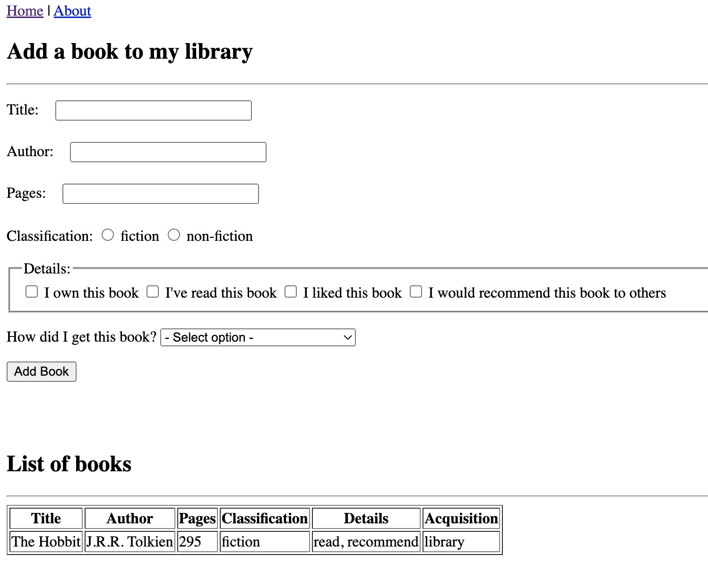

# Pair-Programming

**Developers:** Morgan Albertsen and Jetta Golembiewski

**Description:** We practiced Pair Programming by creating a dynamic website using a Python web framework named Flask. We have alternated working on this assignment, while checking eachothers work and collaberating at each step. We have also built on our Git and GitHub skills by creating a .gitignore file, adding collaborators, and learning to write README files using Markdown

**Instructions for Running Application:** 

1. Clone this repository to local computer

2. Create a new virtual environment

   - Windows: `python -m venv ./venv`
   - Mac: `python3 -m venv ./venv`

3. Activate the new virtual environment

   - Windows: `.\venv\Scripts\activate`
   - Mac: `source ./venv/bin/activate`

4. Install the dependencies `pip install -r requirements.txt`

5. Run the program using either:

   - `flask run`
   - `python app.py
   
6. Test the application by visiting it in your web browser

**TO-DO**

- [x] Catch all selected activities in /add and put them into the python dictionary
- [ ] About page
- [ ] Styling using Bootstrap 5 framework
- [ ] Custom error messages
- [ ] Flash messages
- [ ] API
